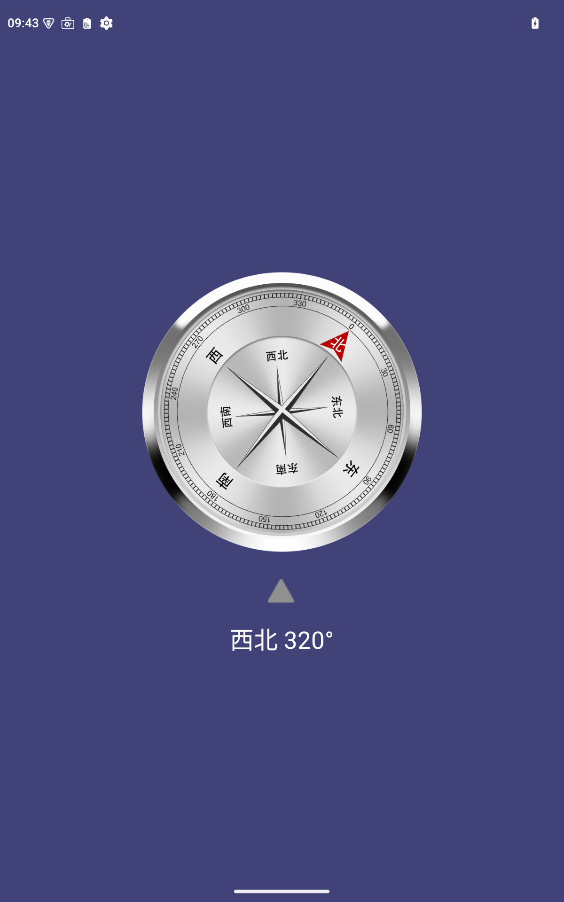
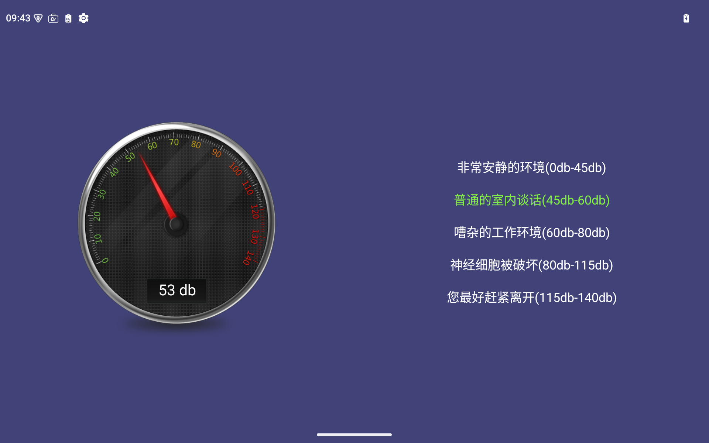
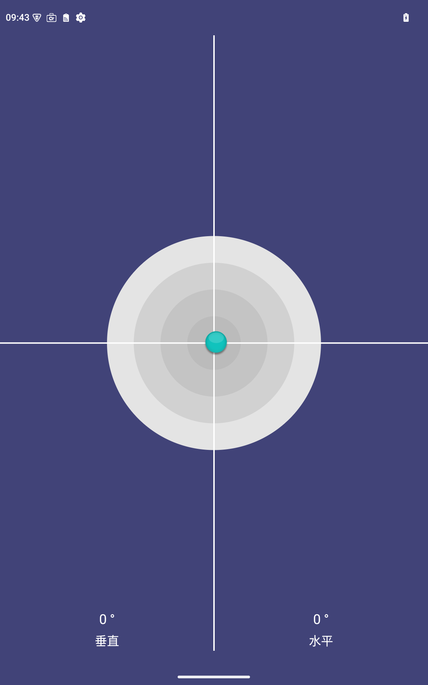
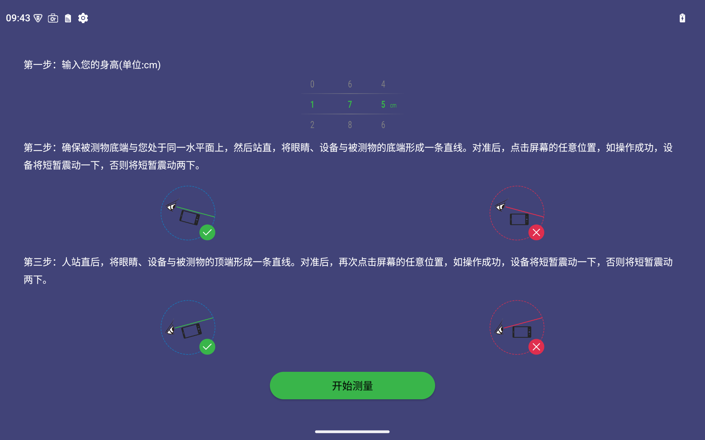
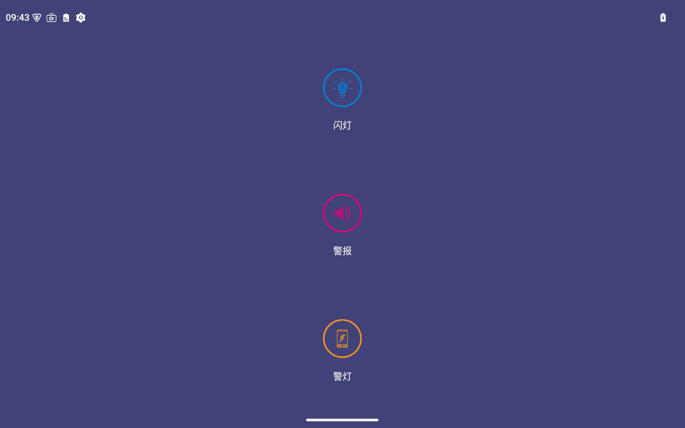
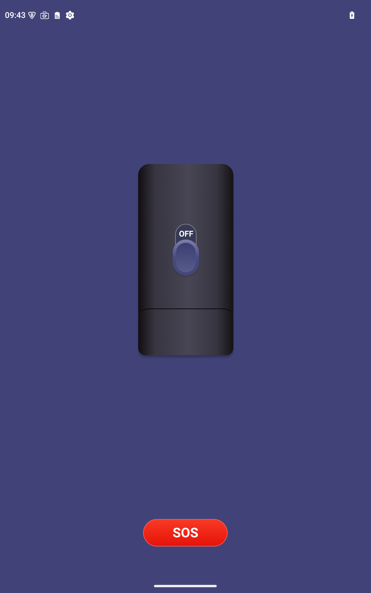
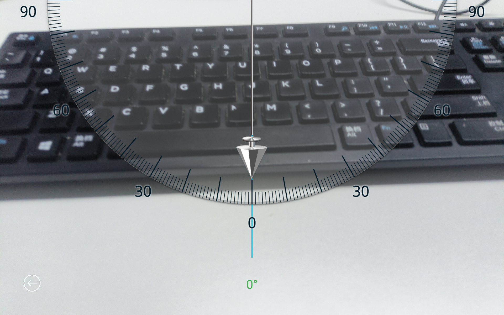
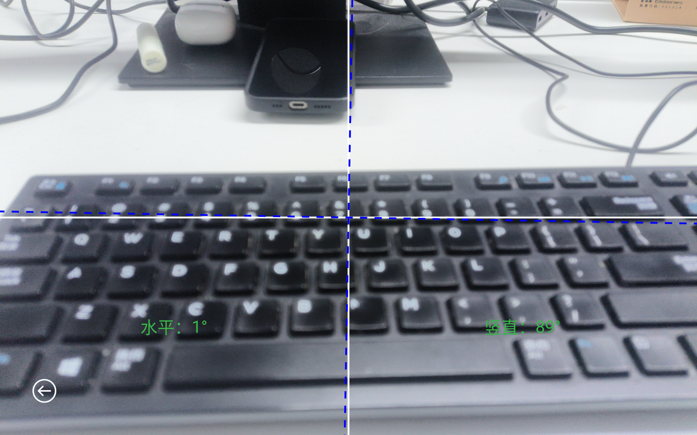
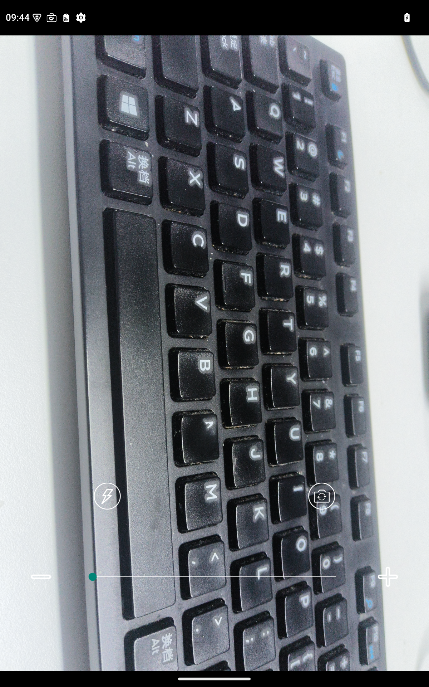
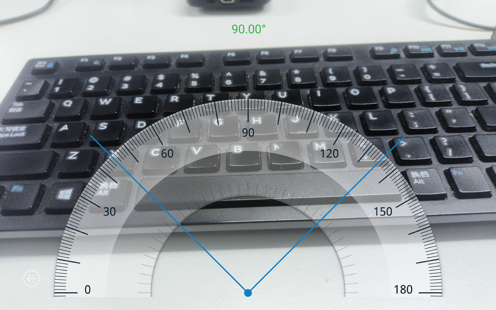

# 工具箱功能介绍

### 工具箱app主要用在消费类三防产品上，主要功能有：指南针，噪音测试，水平仪，高度测量，警报，手电筒，铅锤，挂画，放大镜，量角器。

## 指南针

### 指南针通过获取设备中地磁传感器和重力传感器数据，来解析计算设备当前方向。用于用户野外辨别方向。

## 噪音测试

### 噪音测试通过手机麦克风获取当前实时的环境音，然后通过算法，计算出当前环境音的分贝值。

## 水平仪

### 水平仪通过获取设备的加速度传感器数据，测量三个方向上的重力加速度分量，从而解析出当前设备摆放状态。

## 高度测量

### 高度测量时通过获取设备的加速度传感器数据，计算设备此时的空间方位，然后解析出，设备此时的俯仰角，通过三角函数，计算目标高度和目标距离。

## 警报

### 警报功能主要实现了闪光灯高频闪烁，喇叭播放报警音频，屏幕模拟警灯进行闪烁。用于用户野外求救等场景。

## 手电筒

### 手电筒通过设备闪光灯长亮实现，此外，该功能还实现了SOS功能，打开SOS开关，闪光灯将以SOS特殊频率闪烁。

## 铅锤

### 铅锤功能是通过获取设备的重力传感器数据，计算重力在设备X轴和Y轴上的分量，通过UI渲染并结合后置摄像头画面，从而模拟铅锤效果。

## 挂画

### 挂画功能是通过获取设备的重力传感器数据，计算重力在设备X轴和Y轴上的分量，通过UI渲染并结合后置摄像头画面，绘制指示线，从而模拟挂画辅助器的功能。

## 放大镜

### 放大镜是通过设备自带的摄像头实现的，通过摄像头的数字变焦功能，放大摄像头的预览画面，从而模拟放大镜效果。

## 量角器

### 量角器主要是通过设备的后置摄像头实现的，用户通过拖动屏幕上的两个指示线，工具自动计算两根线之间的夹角度数，从而实现模拟量角器的效果。

